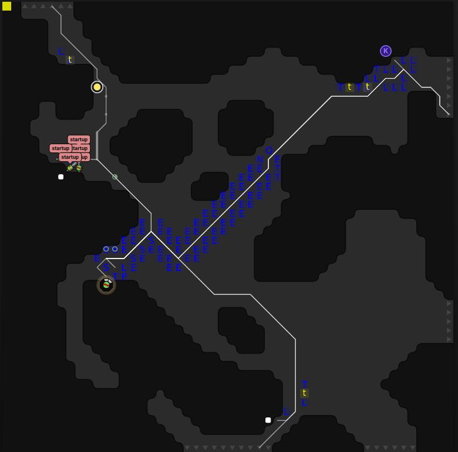
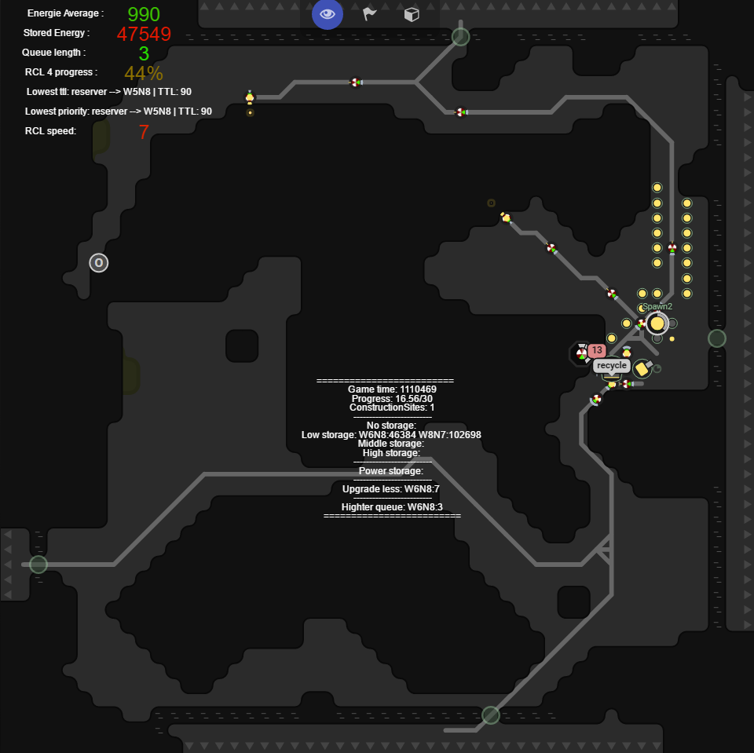

# Layout Visualization

Enable Room layout visualization with
`config.visualizer.enabled = true;` in the `config_local.js`.

Different options are available

 - `showRoomPaths` Fixed room paths
 - `showCreepPaths` Cached path per creep shown in red
 - `showPathSearches` Results of `PathFinder.search`
 - `showStructures` Position of structures
 - `showCreeps` Position of fixed creeps
 - `showBlockers` Position of walls and ramparts
 - `showCostMatrixes` Stored cost matrixes

The default values shown in `config.js`.

# Rooms datas visual

Show by default energy average, energy stored, queue length, rcl progress, and
creeps in queue with minimum ttl and priority of room you actually watching.
You can enable all other datas visible in screenshoot by enabling summary in
config and waiting for the next summary.
